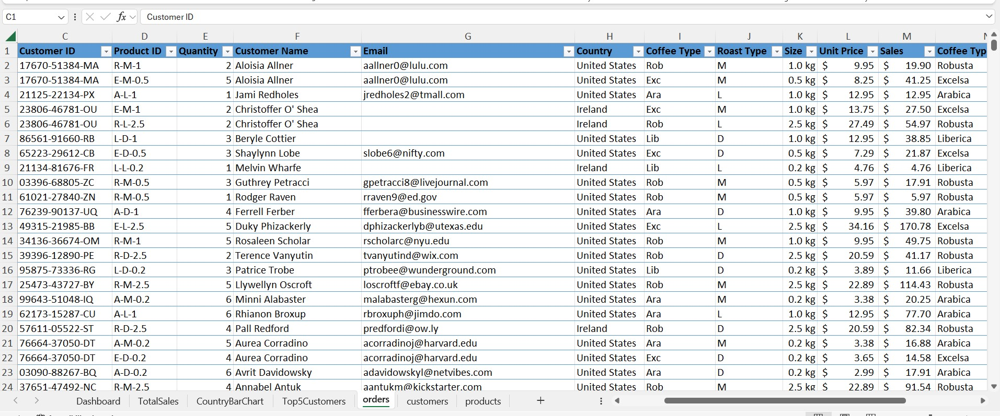
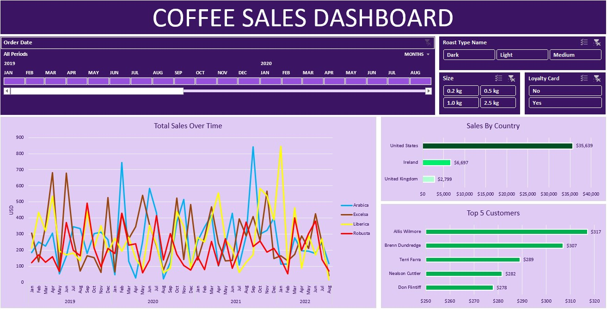
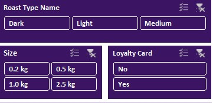
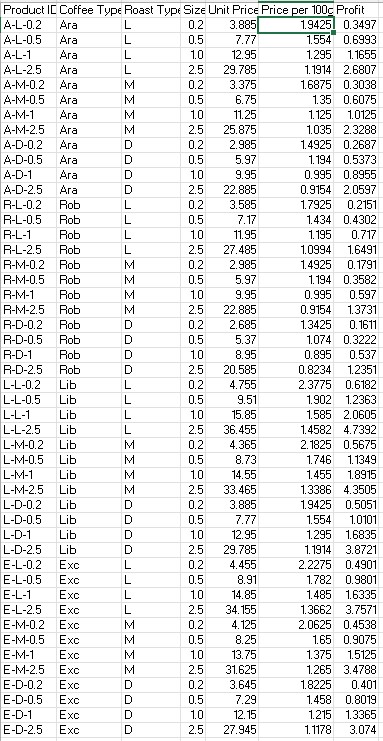

# Coffee Bean Sales Performance Dashboard

## Project Overview

This project is an Excel based sales performance dashboard analyzing coffee bean sales across time, geography, customers, and product attributes. The dashboard delivers interactive insights to support business analysis and data driven decision making.
Project link: https://1drv.ms/x/c/662e9f74a57276b1/IQB3D_VRtGWzS4GWBB6KyyttAZomLnDasJQQxfgPQE_JfdQ?e=VGQaAw

The project demonstrates data analytics skills including data preparation, relational data modeling, KPI development, and dashboard design using Microsoft Excel.

## Tools and Skills Demonstrated

* Microsoft Excel
* PivotTables and PivotCharts
* Interactive slicers and timelines
* Relational data modeling
* Calculated metrics and KPI development
* Dashboard design and data storytelling
* Sales, customer, and product analytics
---

## Business Objective

The objective of this project is to analyze coffee bean sales performance and answer key business questions:

* Which coffee bean types generate the highest revenue
* How sales performance changes over time
* Which countries contribute most to total sales
* Which customers generate the highest sales value
* How roast type, package size, and loyalty status influence sales outcomes

---
### Customer Orders and Customer Information Table

This table contains detailed order and customer level information, including Customer ID, Product ID, quantity ordered, roast type, package size, unit price, total sales, customer location, and loyalty card status. It supports customer segmentation, order analysis, and linkage between transactional and customer data.

---
The dashboard was designed with clarity and usability in mind to support business users.

### Interactive Coffee Sales Dashboard

The dashboard displays total coffee bean sales over time by coffee type and includes slicers for roast type, package size, loyalty card status, and date range. All visuals update dynamically based on user selections.

### Total Sales Over Time by Coffee Type

This line chart displays monthly sales trends by coffee type, including Arabica, Excelsa, Liberica, and Robusta. It enables comparison of performance trends, seasonality, and shifts in customer demand over time.

---

## Customer Analysis

### Top Five Customers by Total Sales

This chart ranks the top five customers based on total sales value. It highlights customer concentration and supports customer value analysis, retention strategy development, and key account identification.

---

## Dashboard Filters and Interactivity

### Slicers for Business Segmentation

This image shows the interactive slicers used in the dashboard, allowing users to filter results by roast type, package size, and loyalty card status. These filters enable targeted analysis of customer behavior and product performance across different segments.

## Data Preparation and Modeling

### Data Cleaning and Standardization

* Standardized date, numeric, and currency fields
* Ensured consistent naming for coffee types, roast types, and countries
* Validated relationships between customer, product, and order data
* Verified sales calculations for accuracy
* Calculated total sales using quantity multiplied by unit price
* Created price per 100g to allow comparison across package sizes
* Calculated profit values to support margin analysis
* Extracted year and month from order dates for time based analysis

---

## Product and Profit Analysis

### Product Pricing and Profit Table

This table summarizes unit price, price per 100g, and profit values across coffee types and package sizes. It supports pricing strategy evaluation, margin comparison, and identification of higher profitability products.

---

## Business Insights

* Sales are primarily driven by the United States market
* Arabica and Excelsa show strong performance across multiple time periods
* Loyalty card customers appear frequently among top spending customers
* Smaller package sizes command higher price per 100g, indicating margin opportunities
* Sales trends vary by coffee type, suggesting seasonal demand patterns

---

## Professional Relevance

This project demonstrates the ability to transform raw sales data into a structured, executive ready dashboard that supports business analysis and strategic decision making. 
