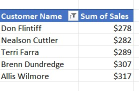
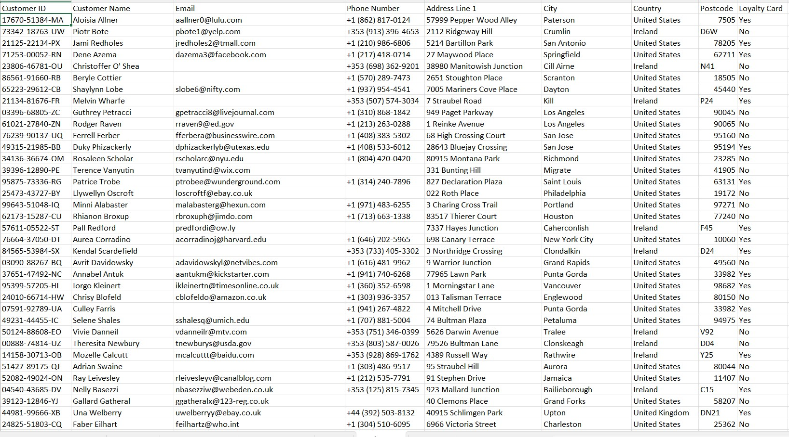

# Coffee Bean Sales Performance Dashboard

## Project Overview

This project is an Excel based sales performance dashboard analyzing coffee bean sales across time, geography, customers, and product attributes.

Key outcomes of the project include:
* Clear visibility into sales trends and performance
* Interactive filtering for business users
* Actionable insights for customer and product analysis

The project demonstrates data analytics skills including data preparation, relational modeling, KPI development, and dashboard creation using Microsoft Excel.

---

## Business Objective

The objective of this dashboard is to analyze coffee bean sales performance and support business decision making by answering the following questions:

* Which coffee bean types generate the highest revenue
* How sales performance changes over time
* Which countries contribute most to total sales
* Which customers generate the highest sales value
* How roast type, package size, and loyalty status influence performance

---

## Dataset Structure

The dataset is organized into multiple related tables that reflect a real world sales environment.

### Orders Table

* Product ID
* Quantity sold
* Unit price
* Total sales
* Coffee type
* Roast type
* Package size
* Country
* Order date

### Customers Table

* Customer ID
* Customer name
* Email
* Phone number
* Address and city
* Country and postcode
* Loyalty card status

### Products Table

* Coffee type
* Roast type
* Package size
* Unit price
* Price per 100g
* Profit calculations

---

## Data Preparation and Modeling

### Step 1 Data Cleaning and Standardization

* Reviewed all tables for formatting consistency
* Standardized date, numeric, and currency fields
* Ensured consistent naming for coffee types, roast types, and countries
* Validated data integrity across tables

### Step 2 Feature Engineering

* Calculated total sales using quantity multiplied by unit price
* Created price per 100g to enable fair comparison across package sizes
* Calculated profit values to support margin analysis
* Extracted year and month from order dates for time based analysis

### Step 3 Data Relationships

* Linked orders table to customers table using customer ID
* Linked orders table to products table using product ID
* Structured the data model to support PivotTables and dashboard filtering

---

## Pivot Tables and Aggregations

PivotTables were created to summarize and analyze sales data.

* Monthly sales by coffee type
* Sales totals by country
* Top five customers by total sales
* Sales distribution by roast type and size

### Monthly Sales Pivot Table

This PivotTable aggregates total sales by year, month, and coffee type and serves as the source for time series analysis.

---

## Dashboard Design

The dashboard was designed with clarity and usability in mind to support non technical business users.

### Interactive Dashboard

Dashboard capabilities include:
* Slicers for roast type, package size, loyalty card status, and date range
* Dynamic chart updates based on selections
* Centralized view of sales performance metrics

---

## Key Visualizations

### Total Sales Over Time

* Displays monthly sales trends by coffee type
* Enables comparison of Arabica, Excelsa, Liberica, and Robusta performance

### Sales by Country

* Highlights revenue distribution by country
* Shows concentration of sales in key markets

### Top Five Customers

* Identifies highest value customers
* Supports customer segmentation and retention analysis

---

## Product and Profit Analysis

### Product Pricing and Profit Table

Insights supported by this table include:
* Price comparison across package sizes
* Margin analysis using price per 100g
* Identification of high profitability products

---

## Customer Data Overview

### Customer Master Table

Supports analysis related to:
* Geographic customer distribution
* Loyalty card segmentation
* Customer value assessment

---

## Business Insights

Key insights derived from the analysis include:

* Sales are primarily driven by the United States market
* Arabica and Excelsa consistently generate strong revenue
* Loyalty card customers frequently appear among top revenue contributors
* Smaller package sizes command higher price per 100g, indicating margin opportunities

---

## Tools and Skills Demonstrated

* Microsoft Excel
* PivotTables and PivotCharts
* Interactive slicers and timelines
* Data modeling and relational structure
* Calculated metrics and KPI development
* Dashboard design and data storytelling
* Sales and customer analytics

---

## Professional Relevance

This project demonstrates the ability to transform raw sales data into a structured dashboard that supports business analysis and decision making. The skills shown align with expectations for business analyst, data analyst, operations analyst, and revenue focused roles.

---

## Project Notes

* Created for portfolio and skills demonstration purposes
* Designed to reflect realistic data structures and analytical workflows
